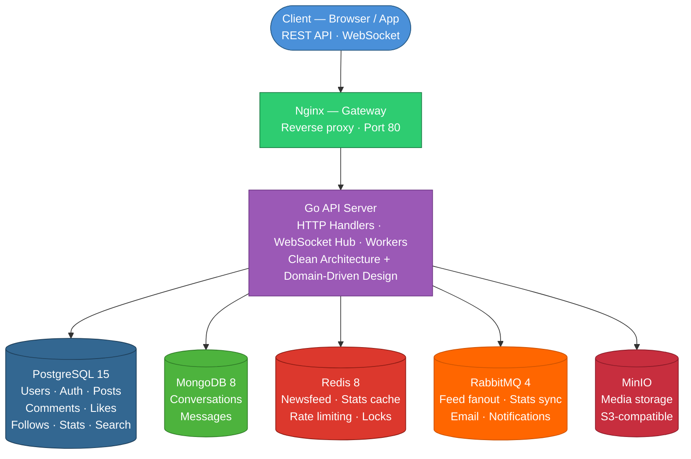

# Air Social

A production-grade social media backend built with Go — featuring a RESTful API, real-time WebSocket chat, and event-driven architecture.


---

## Architecture



---

## Tech Stack

| Layer | Technology |
|---|---|
| **Language** | Go 1.25 |
| **HTTP Framework** | Gin |
| **Primary Database** | PostgreSQL 15 — users, posts, comments, follows, stats |
| **Chat Database** | MongoDB 8 — conversations, messages (schema-flexible, append-optimised) |
| **Cache / Pub-Sub** | Redis 8 — newsfeed, stats deltas, sessions, presence, unread counts |
| **Message Queue** | RabbitMQ 4 — async workers, retry queues, DLQ |
| **Object Storage** | MinIO (S3-compatible) — media files |
| **Gateway** | Nginx — reverse proxy, routing |
| **Infra** | Docker Compose, Alpine Linux base images |

---

## Features

### Core Social ✅

- **Authentication** — JWT access + refresh tokens, multi-device session management, email verification, password reset
- **Posts** — create, edit, delete, share (repost); public / private visibility
- **Comments** — nested replies, media attachments, cursor-paginated
- **Likes** — on posts and comments
- **Follows** — follow / unfollow, followers / following lists
- **Newsfeed** — personalised feed of followed users' posts
- **Search** — full-text post search, user search by name / username
- **Media** — presigned URL upload direct to MinIO (bypasses app server)

### Performance & System Design ✅

- **Fanout-on-Write Newsfeed** — Redis Sorted Set per user, O(1) feed read, async via RabbitMQ
- **Write-Behind Stats Cache** — Redis delta counters, 1-minute batch flush to PostgreSQL, Lua atomic sync
- **Event-Driven Workers** — feed fanout, stats sync, email delivery all run as independent async consumers
- **Cursor Pagination** — timestamp-based for feed, ULID-based for chat; no full-table scans
- **Rate Limiting** — token bucket algorithm per endpoint
- **Graceful Degradation** — stats read falls back to DB-only when Redis is unavailable

### Real-Time Chat 🚧

- Direct (1-on-1) and group conversations
- **Messenger-style inbox routing** — active inbox vs. message requests based on follow relationship; implicit accept on reply
- WebSocket Hub with **Redis Pub/Sub** — horizontally scalable across multiple server instances
- **Presence system** — TTL-based online status (15 s expiry, 10 s heartbeat)
- **Unread counters** — Redis Hash, single `HGETALL` round-trip for all conversations
- Message features: reply-to, reactions (6 types), soft delete, edit
- **Idempotent send** — `client_msg_id` deduplication prevents duplicate messages on retry
- Mark-read with "Seen by X" broadcast to conversation participants

### Notifications 🚧

- Persistent notifications in PostgreSQL with JSONB payload
- **UPSERT deduplication** — partial unique indexes handle NULL target IDs; like → unlike → like = 1 row
- **RabbitMQ retry + Dead Letter Queue** — 3 attempts with 30 s delay, failed events routed to DLQ for inspection
- Real-time push via WebSocket when recipient is online; DB fallback when offline

---

## System Design

### Fanout-on-Write Newsfeed

```
CreatePost ──► PostgreSQL (persist)
           └─► RabbitMQ: EventPostCreated
                              │
                         Feed Worker
                              ├─ fetch followerIDs from PostgreSQL
                              └─ Redis Pipeline for all followers:
                                   ZADD  social:newsfeed:user:{id}  {timestamp}  {postID}
                                   ZREMRANGEBYRANK  ...  0  -501   ← cap at 500 posts
```

**Read path:** `ZREVRANGEBYSCORE` with exclusive timestamp cursor → batch `GetPostsByIDs` → reorder via ID map.

**On delete:** `EventPostDeleted` → `ZREM` from every follower's feed. If the event fails, the postID stays in Redis but the DB returns nothing — silently filtered at query time.

> Full design: [`docs/newsfeed-fanout.md`](docs/newsfeed-fanout.md)

---

### Write-Behind Stats Cache

Direct counter updates under high concurrency cause row-level lock contention. The solution: never write to DB on user actions — accumulate deltas in Redis, flush in bulk every minute.

```
User action → RabbitMQ → Stats Worker → HINCRBY delta in Redis Hash

                               ↓ every 1 minute

                          Stats Syncer
                          ├─ HGetAll deltas
                          ├─ BulkUpsert PostgreSQL (INSERT ... ON CONFLICT DO UPDATE)
                          └─ Lua script: atomic decrement (not HDEL) to preserve
                             new events that arrived during the sync window
```

**Read path:** `Final = max(0, Base_DB + Delta_Redis)` — `max(0, ...)` handles temporary negative drift when unlike arrives before the like is synced.

**Fallback:** if `BulkUpsert` fails, a reconciliation goroutine recalculates counts from source-of-truth tables via SQL `COUNT`.

> Full design: [`docs/stats-write-behind.md`](docs/stats-write-behind.md)

---

### WebSocket Hub + Redis Pub/Sub

```
Client A ──WS──► Hub (instance 1) ──publish──► Redis PubSub "chat:{convID}"
                                                         │
Client B ──WS──► Hub (instance 2) ◄──subscribe──────────┘
```

- One Hub goroutine manages all connections: `map[userID]map[*Client]struct{}` supports multiple tabs/devices per user
- Redis Pub/Sub subscriptions are created on-demand per conversation and cancelled when no clients remain (prevents goroutine leaks)
- Bounded send channel per client (size 256) — a slow client is disconnected rather than blocking the broadcast loop

---

## API Endpoints

<details>
<summary>Authentication</summary>

| Method | Path | Description |
|---|---|---|
| `POST` | `/auth/register` | Register new account |
| `POST` | `/auth/login` | Login, returns JWT tokens |
| `POST` | `/auth/refresh-token` | Refresh access token |
| `POST` | `/auth/logout` | Revoke session(s) |
| `GET` | `/auth/verify-email` | Email verification |
| `POST` | `/auth/forgot-password` | Request password reset |
| `POST` | `/auth/reset-password` | Submit new password |

</details>

<details>
<summary>Users</summary>

| Method | Path | Description |
|---|---|---|
| `GET` | `/users/me` | Get current user profile |
| `PATCH` | `/users/me` | Update profile |
| `PUT` | `/users/me/password` | Change password |
| `PUT` | `/users/me/avatar` | Update avatar |
| `PUT` | `/users/me/cover` | Update cover image |

</details>

<details>
<summary>Posts</summary>

| Method | Path | Description |
|---|---|---|
| `POST` | `/posts` | Create post |
| `GET` | `/posts/:id` | Get post |
| `PATCH` | `/posts/:id` | Edit post |
| `DELETE` | `/posts/:id` | Delete post |
| `GET` | `/users/:id/posts` | User's posts (cursor) |
| `GET` | `/posts/:id/shares` | Users who shared (cursor) |

</details>

<details>
<summary>Comments, Likes, Follows</summary>

| Method | Path | Description |
|---|---|---|
| `POST` | `/posts/:id/comments` | Create comment or reply |
| `GET` | `/posts/:id/comments` | List comments (cursor) |
| `GET` | `/comments/:id/replies` | List replies (cursor) |
| `PATCH` | `/comments/:id` | Edit comment |
| `DELETE` | `/comments/:id` | Delete comment |
| `POST` | `/posts/:id/likes` | Like post |
| `DELETE` | `/posts/:id/likes` | Unlike post |
| `GET` | `/posts/:id/likes` | Users who liked (cursor) |
| `POST` | `/comments/:id/likes` | Like comment |
| `DELETE` | `/comments/:id/likes` | Unlike comment |
| `POST` | `/users/:id/follow` | Follow user |
| `DELETE` | `/users/:id/follow` | Unfollow user |
| `GET` | `/users/:id/followers` | Followers list |
| `GET` | `/users/:id/followings` | Following list |

</details>

<details>
<summary>Feed, Search, Media</summary>

| Method | Path | Description |
|---|---|---|
| `GET` | `/feed` | Personalised newsfeed (cursor) |
| `GET` | `/search/users` | Search users (cursor) |
| `GET` | `/search/posts` | Full-text post search (cursor) |
| `POST` | `/media/presigned-urls` | Get presigned upload URLs |

</details>

<details>
<summary>Chat 🚧</summary>

| Method | Path | Description |
|---|---|---|
| `POST` | `/conversations/direct` | Create or get direct (1-on-1) conversation |
| `POST` | `/conversations/group` | Create group conversation |
| `GET` | `/conversations` | List active conversations (cursor) |
| `GET` | `/conversations/pending` | Message requests (cursor) |
| `GET` | `/conversations/:id` | Get conversation |
| `PATCH` | `/conversations/:id` | Update group info |
| `POST` | `/conversations/:id/accept` | Accept message request |
| `POST` | `/conversations/:id/ignore` | Ignore message request |
| `POST` | `/conversations/:id/members` | Add member |
| `DELETE` | `/conversations/:id/members/:uid` | Remove member |
| `GET` | `/conversations/:id/messages` | List messages (cursor) |
| `POST` | `/conversations/:id/messages` | Send message |
| `PATCH` | `/conversations/:id/messages/:mid` | Edit message |
| `DELETE` | `/conversations/:id/messages/:mid` | Delete message |
| `POST` | `/conversations/:id/messages/:mid/reactions` | Add reaction |
| `DELETE` | `/conversations/:id/messages/:mid/reactions` | Remove reaction |
| `PUT` | `/conversations/:id/read` | Mark as read |
| `GET` | `/ws` | WebSocket connection |

</details>

<details>
<summary>Notifications 🚧</summary>

| Method | Path | Description |
|---|---|---|
| `GET` | `/notifications` | List notifications (cursor) |
| `GET` | `/notifications/unread-count` | Unread badge count |
| `PUT` | `/notifications/read` | Mark all read |
| `PUT` | `/notifications/:id/read` | Mark one read |

</details>

---

## Getting Started

```bash
make rebuild      # Build Docker images
make up           # Start full stack
make migrate-up   # Create database tables
make seed         # Seed with dummy data
```

See [`docs/guides/GETTING_STARTED.md`](docs/guides/GETTING_STARTED.md) for the full setup guide including environment configuration.

After startup, access the services:

| Service | URL | Credentials |
|---|---|---|
| API Swagger | http://localhost/air-social/api/v1/swagger/index.html | — |
| Health Check | http://localhost/air-social/api/v1/health | `admin / password` |
| RabbitMQ UI | http://localhost/rabbitmq/ | `admin / password` |
| MinIO Console | http://localhost/storage-admin/ | `admin / password` |

---

## Development Commands

```bash
# Stack management
make up           # Start all services
make down         # Stop all services
make rebuild      # Rebuild images and restart
make restart      # Restart app container only
make logs         # Follow app logs
make infra        # Start only dependencies (DB, Redis, etc.)

# Database
make migrate-up           # Apply all migrations
make migrate-down         # Rollback last migration
make migrate-create name= # Create new migration file
make reset-postgresdb     # Drop and recreate database

# Development
make seed         # Seed database with dummy data
make docs         # Regenerate Swagger documentation
make mocks        # Regenerate mocks with mockery

# Testing
make test               # Run all tests
make test-cover         # Run with coverage report
make test-cover-html    # HTML coverage report
make test-bench         # Run benchmarks
```
